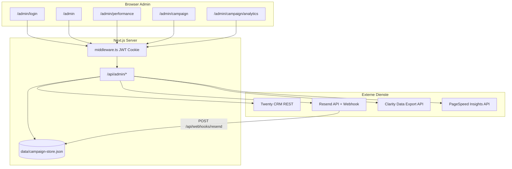

# Admin-Portal — Implementierung & Funktionen

Dokumentation des geschützten Bereichs unter `/admin` für **flagmeier.engineering**: Performance-Metriken, B2B-E-Mail-Kampagne (Engineering-Akquise), Kampagnen-Analyse und Anbindungen an **Twenty CRM**, **Resend**, **Microsoft Clarity** und **Google PageSpeed Insights**.

Stand: Codebasis Homepage (Next.js App Router).

---

## Inhaltsverzeichnis

1. [Überblick & Architektur](#überblick--architektur)
2. [Authentifizierung & Sicherheit](#authentifizierung--sicherheit)
3. [Seiten (UI)](#seiten-ui)
4. [Admin-API](#admin-api)
5. [Öffentliche APIs (Kampagne)](#öffentliche-apis-kampagne)
6. [Datenspeicher & Zustand](#datenspeicher--zustand)
7. [Externe Systeme](#externe-systeme)
8. [Kern-Bibliotheken](#kern-bibliotheken)
9. [NPM-Skripte & Production](#npm-skripte--production)
10. [Umgebungsvariablen](#umgebungsvariablen)
11. [Typische Workflows](#typische-workflows)

---

## Überblick & Architektur



| Schicht | Rolle |
|--------|--------|
| **Middleware** | Schützt alle `/admin/*`-Routen außer `/admin/login` per JWT-Cookie |
| **Admin-UI** | Client-Komponenten laden Daten per `fetch` mit `credentials: "same-origin"` |
| **Admin-API** | JSON-Endpunkte unter `/api/admin/*`; eigene Cookie-Prüfung (Matcher schließt `api` aus) |
| **Campaign Store** | Lokale JSON-Datei für Events, Abmeldungen, Resend-Historie |
| **Twenty CRM** | Quelle der Kontakte (People); Ziel für Last-Contact-Felder |

---

## Authentifizierung & Sicherheit

### Session

| Element | Datei / Konstante |
|---------|------------------|
| Cookie-Name | `fe_admin_session` (`ADMIN_SESSION_COOKIE`) |
| Token | JWT, HS256, Laufzeit **7 Tage** |
| Secret | `ADMIN_SESSION_SECRET` (min. 32 Zeichen) |
| Passwort | Bcrypt-Hash: `ADMIN_PASSWORD_HASH_B64` (empfohlen) oder `ADMIN_PASSWORD_HASH` |
| Benutzername | `ADMIN_USERNAME` (Standard: `admin`) |

**Ablauf:**

1. `POST /api/admin/login` — Benutzername/Passwort prüfen, Cookie setzen (`httpOnly`, `sameSite`, `secure` in Production).
2. `middleware.ts` — Für `/admin/*` (außer Login): Cookie vorhanden und `jwtVerify` erfolgreich, sonst Redirect zu `/admin/login?next=…`.
3. `isAdminRequestAuthenticated()` — In allen Admin-API-Routen; bei Fehlschlag **401 Unauthorized**.

**Hilfs-Endpunkte:**

- `POST /api/admin/logout` — Cookie löschen.
- `GET /api/admin/config` — Diagnose (ohne Secrets): ob Secret/Hash konfiguriert sind.

**Skripte (lokal):**

- `npm run hash-admin-password`
- `npm run encode-admin-hash-b64`
- `npm run verify-admin-env`

### SEO / Indexierung

Admin-Layout setzt `robots: noindex, nofollow` für alle Admin-Seiten.

---

## Seiten (UI)

Navigation in `AdminShell` (außer Startseite `/admin`, die eigenes Layout hat):

| Link | Pfad | Komponente | Beschreibung |
|------|------|------------|--------------|
| Performance | `/admin` | `AdminPerformanceDashboard` | PageSpeed (Mobile/Desktop) + Clarity-Export-Übersicht |
| Lighthouse | `/admin/performance` | `PageSpeedWidget`, `BingIndexerPlaceholder` | Detaillierter Lighthouse-Audit, Bing-Platzhalter |
| E-Mail-Kampagne | `/admin/campaign` | `EngineeringCampaignDashboard` | Kontakte, Editor, Versand, Sync |
| Kampagnen-Analyse | `/admin/campaign/analytics` | `CampaignAnalyticsDashboard` | Funnel, Segmente, Resend/Clarity, Follow-up |

### `/admin` — Performance-Startseite

- Lädt parallel:
  - `GET /api/admin/metrics/pagespeed` — PSI Mobile + Desktop
  - `GET /api/admin/metrics/clarity` — Clarity Data Export (aggregiert)
- Zeigt `ClarityInsights` (Sessions, Scrolltiefe, Frustration, Top-URLs, …).
- Links zu Lighthouse- und Kampagnen-Seiten.
- **Hinweis:** Google Search Console ist im Code vorbereitet (`/api/admin/metrics/gsc`), wird auf der Startseite aber nicht aktiv genutzt.

### `/admin/performance` — Lighthouse & Indexierung

- `PageSpeedWidget`: Live-Audit einer konfigurierbaren URL (PageSpeed API).
- `BingIndexerPlaceholder`: UI-Platzhalter ohne API-Anbindung.

### `/admin/login`

- `AdminLoginForm` → `POST /api/admin/login`.
- Nach Erfolg Redirect auf `next` oder `/admin`.

### `/admin/campaign` — B2B E-Mail-Kampagne

Breites Layout (`AdminShell wide`, max. ~1400px). Zwei-Spalten-Grid: Kontaktliste links, E-Mail-Vorschau rechts (sticky).

**Bereiche:**

1. **Link zur Kampagnen-Analyse**
2. **Tracking** (`<details>`): Erklärung `user_id` = Twenty People `id`
3. **Kontakt-Historie (Production)**  
   - **1. Resend → Store** → `POST /api/admin/campaign/analytics/sync`  
   - **2. Store → Twenty** → `POST /api/admin/campaign/sync-last-contact`  
   (Ersetzt `npm run` auf dem Server.)
4. **Kampagne** — Betreff, Absender, Resend-Status, Ziel-URL
5. **CampaignEmailEditor** — Betreff, Ansprache (Du/Sie), Absätze, CTA, Signatur; Presets; optional **KI-Vorschlag** (`POST /api/admin/campaign/suggest`)
6. **Test-E-Mail** (`<details>`) — Einzelversand an Testadresse
7. **UTM-Parameter** — `utm_source`, `utm_medium`, `utm_campaign`; „Links aktualisieren“
8. **TwentyPeoplePanel** — Kontaktliste (siehe unten)
9. **E-Mail-Vorschau** — iframe mit gerendertem HTML; Tracking-Link / Plain-Text in `<details>`

**TwentyPeoplePanel — Funktionen:**

| Funktion | Beschreibung |
|----------|--------------|
| Suche | Name, Firma, E-Mail |
| Filter-Chips | Mit E-Mail, Ohne Opt-out, Nie kontaktiert |
| Sortierung | Name, Firma, E-Mail, Zuletzt kontaktiert |
| Pagination | 25 / 50 / 100 pro Seite |
| Auswahl | Checkbox pro versendbarem Lead; „Seite auswählen“; „Alle versendbaren“ |
| Zeile klicken | Vorschau laden + Lead auswählen (wenn versendbar) |
| Status-Badges | Versendbar, Abgemeldet, Unzustellbar |
| Zuletzt kontaktiert | Aus Store + Twenty (Merge, neueres Datum gewinnt) |
| Aktionen | Neu laden, Dry-Run, Versand (Resend) |

**Versand-Logik (UI):**

- `POST /api/admin/campaign` mit `leadIds`, `dryRun`, `utm`, `content`
- Bestätigungsdialog bei echtem Versand
- Send-Log (aufklappbar) mit Ergebnis pro Lead

### `/admin/campaign/analytics` — Kampagnen-Analyse

- `GET /api/admin/campaign/analytics` — baut Report (inkl. optional Resend-Sync beim Laden)
- Filter: `utm_campaign` (Query-Parameter)
- **Resend synchronisieren** — expliziter `POST …/analytics/sync`
- Segmente: hot, warm, mild, cold, not_sent, bounced, unsubscribed, complained
- Tabellen: Follow-up jetzt, Top-Interesse, alle Leads mit Score, Empfehlung, Resend-/Clarity-Signalen
- Verhalten-Leitfaden (wann anrufen, wann nicht mailen, …)

---

## Admin-API

Alle Routen erfordern gültiges Admin-Session-Cookie (außer Login).

### Login & Konfiguration

| Methode | Pfad | Funktion |
|---------|------|----------|
| POST | `/api/admin/login` | Anmeldung, Set-Cookie |
| POST | `/api/admin/logout` | Abmeldung |
| GET | `/api/admin/config` | Konfigurationsdiagnose |

### Metriken

| Methode | Pfad | Funktion |
|---------|------|----------|
| GET | `/api/admin/metrics/pagespeed` | PageSpeed Insights (mobile + desktop) |
| GET | `/api/admin/metrics/clarity` | Clarity Data Export API |
| GET | `/api/admin/metrics/gsc` | GSC (vorbereitet, optional env) |

### Kampagne — Kern

| Methode | Pfad | Funktion |
|---------|------|----------|
| GET | `/api/admin/campaign` | Twenty-Leads laden, UTM an Tracking-Links, Meta (Resend, Twenty, Zähler) |
| POST | `/api/admin/campaign` | Batch-Versand oder Dry-Run |
| POST | `/api/admin/campaign/preview` | HTML/Text-Vorschau für einen Lead |
| POST | `/api/admin/campaign/test` | Test-Mail an beliebige Adresse |
| GET/POST | `/api/admin/campaign/suggest` | KI-Status / E-Mail-Textvorschlag (OpenAI) |
| GET | `/api/admin/campaign/events` | Letzte Events + Abmelde-Statistik |

**GET `/api/admin/campaign` — Query:**

- `utm_source`, `utm_medium`, `utm_campaign` — für generierte Tracking-URLs pro Lead

**POST `/api/admin/campaign` — Body:**

```json
{
  "leadIds": ["uuid-…"],
  "dryRun": false,
  "utm": { "utm_source": "…", "utm_medium": "…", "utm_campaign": "…" },
  "content": { "subject": "…", "paragraphs": ["…"], "addressing": "sie" }
}
```

### Kampagne — Analyse & Sync

| Methode | Pfad | Funktion |
|---------|------|----------|
| GET | `/api/admin/campaign/analytics` | Vollständiger `CampaignAnalyticsReport`; Query `syncResend=false` möglich |
| POST | `/api/admin/campaign/analytics/sync` | Resend-API → `campaign-store` (Opens, Clicks, `email_sent`, …) |
| POST | `/api/admin/campaign/sync-last-contact` | Store `email_sent` → Twenty-Felder `lastContactedAt` usw. |

**Sync-last-contact — Antwort bei Fehlern:**

- `missingFields`, `errorSummary`, `errors[]`, `hint` (z. B. fehlende Custom Fields)

---

## Öffentliche APIs (Kampagne)

Nicht über Admin-Login geschützt; für Empfänger und Resend.

| Methode | Pfad | Funktion |
|---------|------|----------|
| GET | `/api/campaign/unsubscribe` | Abmeldung (signiertes `token` oder Query-Parameter) |
| POST | `/api/webhooks/resend` | Resend-Events (delivered, opened, clicked, bounced, complained) |

**Webhook:** Erfordert `RESEND_WEBHOOK_SECRET` (Svix-Signatur). Schreibt Events in den Store; bei Bounce/Complaint → Abmeldung/Unzustellbar inkl. Twenty-Update.

**Abmeldung:** Speichert global pro `user_id` und E-Mail; blockiert künftigen Versand; optional Twenty-Status.

---

## Datenspeicher & Zustand

### `data/campaign-store.json`

Pfad: Projektroot `data/campaign-store.json` (gitignored in Production üblich).

| Bereich | Inhalt |
|---------|--------|
| `events[]` | Kampagnen-Events (max. 5000, älteste werden abgeschnitten) |
| `unsubscribes{}` | Pro `userId`: Abmeldung / Unzustellbar |
| `unsubscribedEmails{}` | Normalisierte E-Mail → opted out |

**Event-Typen:**

| Typ | Bedeutung |
|-----|-----------|
| `email_sent` | Echter Versand (zählt für „Zuletzt kontaktiert“) |
| `email_test` | Test-Mail |
| `email_dry_run` | Simulation |
| `unsubscribe` | Abmeldung |
| `resend.delivered` / `opened` / `clicked` / `bounced` / `complained` | Resend-Status |

**„Zuletzt kontaktiert“ (Admin + Merge):**

- Index aus Store: nur `email_sent`, pro `userId` das **neueste** `at`
- Twenty-Felder: `lastContactedAt`, `lastContactCampaign`, `lastContactChannel`
- `mergeLastContact()` — lokales Store-Datum vs. Twenty; **neueres** gewinnt

### Browser (Kampagne)

- `localStorage`: gespeicherter E-Mail-Editor-Inhalt (`CampaignEmailEditor`)

---

## Externe Systeme

### Twenty CRM

| Aspekt | Details |
|--------|---------|
| API | `TWENTY_API_URL` + `TWENTY_API_KEY` |
| Leads | `GET /rest/people?depth=1` (Pagination, optional `TWENTY_PEOPLE_LIMIT`) |
| Felder People | `emails` / `Emails`, `phones` / `Phones`, `firma`, `id` (→ `user_id`) |
| Last Contact | Custom Fields (Setup-Skript oder manuell im Datenmodell) |
| Nach Versand | `markTwentyPersonLastContacted` (PATCH) |
| Abmeldung/Bounce | `markTwentyPersonUnsubscribed` / `markTwentyPersonUndeliverable` |

**Resend-Zuordnung:**

1. Tag `user_id` in Resend-Mail  
2. Sonst E-Mail ↔ Twenty `emails.primaryEmail`  
3. Sonst frühere Events im Store (`skippedNoUser` wenn nichts passt)

### Resend

| Aspekt | Details |
|--------|---------|
| Versand | `RESEND_API_KEY`, `RESEND_FROM` |
| Lesen (Sync) | Full-Access-Key oder `RESEND_API_KEY_READ` |
| Tags pro Mail | `user_id`, `utm_*`, `company` |
| Rate Limit | ~220 ms Abstand zwischen Sends; Retry bei 429 |
| Webhook | Production-URL: `https://flagmeier.engineering/api/webhooks/resend` |

### Microsoft Clarity

| Aspekt | Details |
|--------|---------|
| Browser | `NEXT_PUBLIC_CLARITY_PROJECT_ID` |
| Admin Export | `CLARITY_EXPORT_API_TOKEN` + Projekt-ID |
| Analytics | UTM + `user_id` in URLs → Sessions, Verweildauer, `utm_content` |

`numOfDays` für Export API: **1–3** (nicht 28).

### PageSpeed Insights

- `GOOGLE_PAGESPEED_API_KEY`
- Optional `GOOGLE_PAGESPEED_HTTP_REFERER` / `ADMIN_METRICS_SITE_URL`

---

## Kern-Bibliotheken

| Modul | Verantwortung |
|-------|----------------|
| `src/lib/twenty-crm.ts` | People laden, PATCH, Last Contact, Unsubscribe-Status |
| `src/lib/engineering-campaign.ts` | Lead-Typ, Tracking-URLs, `user_id` |
| `src/lib/engineering-campaign-utm.ts` | UTM-Parsing, Defaults |
| `src/lib/engineering-campaign-send.ts` | Rendern, Versand, Batch, Twenty-Updates |
| `src/lib/campaign-store.ts` | JSON-Persistenz Events/Abmeldungen |
| `src/lib/campaign-last-contact.ts` | Index „letzter Kontakt“ aus Store |
| `src/lib/campaign-last-contact-utils.ts` | Merge, Formatierung (client-tauglich) |
| `src/lib/resend-campaign-sync.ts` | Resend-API → Store |
| `src/lib/campaign-analytics.ts` | Report, Segmente, Engagement-Score |
| `src/lib/campaign-clarity-utm.ts` | Clarity-Export mit UTM-Filter |
| `src/lib/campaign-email-validation.ts` | E-Mail parsen, Resend-Tags, Rate-Limit-Klassifikation |
| `src/lib/campaign-email-content.ts` | Editor-Inhalt, Presets |
| `src/lib/campaign-unsubscribe.ts` | Signierte Abmelde-Links |
| `src/lib/campaign-ai-suggest.ts` | OpenAI-Vorschläge |
| `emails/EngineeringCampaign.tsx` | React-Email-Template |

### E-Mail-Template & Tracking

Jeder Lead erhält personalisierte Links zur Site mit:

- `user_id` = Twenty People UUID (stabil für Clarity/Analytics)
- `utm_source`, `utm_medium`, `utm_campaign`, optional `utm_content` (welcher Link in der Mail)
- `company` (Firma)

Abmelde-Link: HMAC-signiert (`CAMPAIGN_SIGNING_SECRET` oder `ADMIN_SESSION_SECRET`).

### Engagement-Segmente (Analytics)

Score aus u. a.:

- Resend: Opens, **mehrfache** Clicks, letztes Event
- Clarity: Sessions mit E-Mail-UTM, Verweildauer, distinct pages
- Status: bounced, unsubscribed, not_sent

→ Segment `hot` … `cold` + Text-Empfehlung („anrufen“, „nicht mailen“, …).

---

## NPM-Skripte & Production

| Skript | Befehl | Zweck |
|--------|--------|--------|
| Resend-Sync | `npm run campaign:resend:sync` | CLI: Resend → Store |
| Twenty Backfill | `npm run campaign:sync-last-contact` | CLI: Store → Twenty |
| Felder anlegen | `npm run twenty:setup-last-contact-fields` | Metadata API: Custom Fields |
| Versand CLI | `npm run campaign:engineering:send` | Batch ohne UI |
| Dry-Run CLI | `npm run campaign:engineering:dry-run` | Simulation |

**Production (ohne npm im PATH):**

- Deploy der App (Next.js `start`)
- Sync über Admin-UI oder `curl` mit Admin-Cookie auf:
  - `POST /api/admin/campaign/analytics/sync`
  - `POST /api/admin/campaign/sync-last-contact`

Lokaler `campaign-store.json` ≠ Server-Store, sofern nicht dieselbe Datei deployed/kopiert wird.

---

## Umgebungsvariablen

Vollständige Liste: `.env.example`. Auszug Admin/Kampagne:

| Variable | Bereich |
|----------|---------|
| `ADMIN_SESSION_SECRET`, `ADMIN_PASSWORD_HASH_B64`, `ADMIN_USERNAME` | Admin-Login |
| `RESEND_API_KEY`, `RESEND_API_KEY_READ`, `RESEND_FROM` | Mail |
| `RESEND_WEBHOOK_SECRET` | Webhook |
| `TWENTY_API_URL`, `TWENTY_API_KEY` | CRM |
| `TWENTY_LAST_CONTACT_*_FIELD` | Namen der Custom Fields |
| `TWENTY_PATCH_UTM_FIELDS=true` | Nur wenn UTM-Felder auf People existieren |
| `TWENTY_PEOPLE_LIMIT`, `TWENTY_PEOPLE_PAGE_SIZE` | Pagination |
| `CLARITY_EXPORT_API_TOKEN`, `NEXT_PUBLIC_CLARITY_PROJECT_ID` | Analytics |
| `GOOGLE_PAGESPEED_API_KEY` | Performance |
| `OPEN_API_KEY` / `OPENAI_API_KEY` | KI-Vorschläge |
| `CAMPAIGN_SIGNING_SECRET` | Abmelde-Links |

---

## Typische Workflows

### Neue Kampagne versenden

1. `/admin/campaign` — Twenty „Neu laden“
2. E-Mail-Inhalt prüfen/anpassen, UTM setzen
3. Leads filtern (z. B. „Nie kontaktiert“), auswählen
4. Dry-Run → Versand  
   → Store: `email_sent`; Twenty: `lastContactedAt` (wenn PATCH ok)

### Historie nachziehen (Production)

1. **Resend → Store** (Admin-Button oder API)  
2. **Store → Twenty** (nach Deploy mit Feld-Check)  
3. „Neu laden“ in der Kampagne

### Analyse & Follow-up

1. `/admin/campaign/analytics`  
2. Optional `utm_campaign` filtern  
3. Segment „hot“ / „Follow-up jetzt“ — Empfehlungen in der Tabelle

### Abmeldung / Bounce

- Empfänger: Link in Mail → `/api/campaign/unsubscribe`
- Resend: Webhook → Store + ggf. `processUndeliverable` → kein weiterer Versand

---

## Dateistruktur (Referenz)

```
src/app/admin/
  layout.tsx              # Admin-Layout, noindex
  page.tsx                # Performance-Start
  login/page.tsx
  performance/page.tsx
  campaign/page.tsx
  campaign/analytics/page.tsx
  actions.ts              # Server Action logout

src/app/api/admin/
  login|logout|config/
  metrics/pagespeed|clarity|gsc/
  campaign/route.ts
  campaign/preview|test|suggest|events/
  campaign/analytics/route.ts
  campaign/analytics/sync/route.ts
  campaign/sync-last-contact/route.ts

src/components/admin/
  AdminShell.tsx
  AdminLoginForm.tsx
  AdminPerformanceDashboard.tsx
  EngineeringCampaignDashboard.tsx
  TwentyPeoplePanel.tsx
  CampaignEmailEditor.tsx
  CampaignAnalyticsDashboard.tsx
  clarity-insights.tsx
  PageSpeedWidget.tsx
  BingIndexerPlaceholder.tsx

src/lib/
  twenty-crm.ts
  engineering-campaign*.ts
  campaign-*.ts
  resend-campaign-sync.ts
  clarity-export.ts
  admin-session.ts
  admin-api-auth.ts

data/
  campaign-store.json     # Runtime (nicht im Repo)

scripts/
  sync-resend-campaign.ts
  sync-last-contact-twenty.ts
  setup-twenty-last-contact-fields.ts
  send_engineering_campaign.ts
```

---

## Verknüpfungen zur öffentlichen Website

| Von | Nach | Zweck |
|-----|------|--------|
| Kampagnen-Mail | `https://flagmeier.engineering/…?user_id&utm_*` | Clarity + interne Auswertung |
| Mail-CTA | Kalender / Leistungen (konfigurierbar im Content) | Conversion |
| Abmelde-Link | `/api/campaign/unsubscribe?token=…` | Opt-out |
| Kontaktformular | `/api/contact` (Resend) | Separater Kanal, nicht Admin |

---

*Bei Erweiterungen diese Datei mit anpassen (neue Routen, Felder, env-Variablen).*
