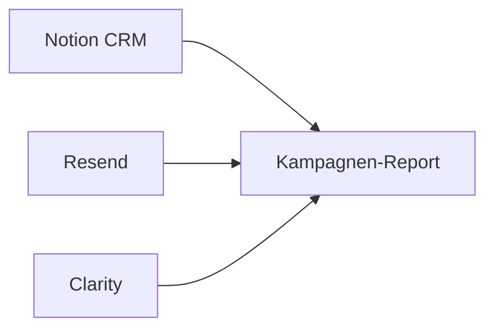

# Kampagnen-Report (Management-Sicht)

## 1) EXECUTIVE SUMMARY — Die Kernfragen

*Erstellt: 2026-05-13 13:33 UTC* · Ziel: **Management-Sicht** — Rohdaten unten eingeklappt (Notion Toggle / Marker).

<!-- CALLOUT_GREEN_START -->
### 🟢 WAS LIEF GUT

- **186 CRM-Kontakte** mit E-Mail — Datenbasis fuer diesen Report.
- **Resend angebunden:** 171 CRM-Adressen im letzten Send-Sample wiedererkennbar.

<!-- CALLOUT_GREEN_END -->

<!-- CALLOUT_EXEC_BAD_START -->
### 🔴 WAS LIEF SCHLECHT / RISIKO

- **34 Kontakte** mit riskantem E-Mail-Status (bounce / unsubscribe o.ae.).
- **Clarity SMC:** CLARITY_TOKEN fehlt
- **Clarity URL:** CLARITY_TOKEN fehlt

<!-- CALLOUT_EXEC_BAD_END -->

<!-- CALLOUT_TOOL_START -->
### 🛠️ VERBESSERUNGEN KAMPAGNE (E-Mail / CRM)

- *Keine zusaetzlichen Kampagnen-Massnahmen aus den Regeln — Prioritaet laut Action-List.*

<!-- CALLOUT_TOOL_END -->

<!-- CALLOUT_LAPTOP_START -->
### 💻 VERBESSERUNGEN HOMEPAGE / LANDING

- **Hinweis:** Dieser Export liefert **keine Verweildauer pro Seitenvariante**. Fuer Homepage/CTA-Tiefe bitte **Clarity Recordings / Dashboard** oder **Heatmaps** nutzen.

<!-- CALLOUT_LAPTOP_END -->

<!-- CALLOUT_FAZIT_START -->
### 📌 FAZIT & SOFORT-PRIORITAET

- **Naechster Schritt:** Sales laut **Action-List (Abschnitt 2)** priorisieren; Blocker aus dem **🔴-Kasten** zuerst abarbeiten; Rohdaten bei Bedarf in den **Toggles** unter Abschnitt 3 ausklappen.

<!-- CALLOUT_FAZIT_END -->

## Visuelles Dashboard — Clarity Traffic-Quellen (SMC)

> Clarity SMC nicht verfuegbar (`CLARITY_TOKEN fehlt`) — kein Diagramm.

---

## 2) 🔥 ACTION LIST: SALES PRIORITY

**Wer muss kontaktiert werden?** Ganz oben: **Clarity-nachgewiesenes Engagement** (`Kunden_ID` = `user_id` in den URL-Sessions — dieselbe Logik wie im Toggle **Clarity URL / user_id Join** in Abschnitt 3) — absteigend nach **Anzahl Sessions**. Dort gilt Clarity als **Single Source of Truth**: CRM-Status *cold* / *idle* zählt im Report als **Hot**, wenn Sessions vorliegen. Danach: **Hot** nur aus CRM-Klicks (ohne Clarity-Match im Fenster), dann **Warm** (Opens ohne Klick, ohne Clarity-Hot), zuletzt **Next_Send_At**.

<!-- CALLOUT_FIRE_START -->
### 🔥 Hot Leads — Clarity-nachgewiesen (`Kunden_ID` = `user_id`)

- *(Clarity-URL-Dimension nicht verfuegbar — keine Session-Zuordnung: `CLARITY_TOKEN fehlt`)*

### 🔥 Hot Leads — CRM meldet Klick (ohne Clarity-Match im URL-Fenster)

- *(Keine CRM-Klick-Hot-Leads ohne Clarity-URL-Match — oder Resend/CRM-Zähler leer.)*

### ⚡ Warm Leads (Opens, kein Klick — ohne Clarity-Hot)

- *(Keine Warm-Leads im oberen Segment.)*

### 📅 Geplanter Kontakt (Next_Send_At)

- **SEW-Eurodrive** — Next_Send_At `2026-05-12T15:03:00.000+00:00`, Sequence `live_demo`, Report-Tier `cold` (CRM-Zähler-Tier `cold`)
- **Kreisel Electric** — Next_Send_At `2026-05-12T15:03:00.000+00:00`, Sequence `live_demo`, Report-Tier `cold` (CRM-Zähler-Tier `cold`)
- **Kreisel Electric GmbH** — Next_Send_At `2026-05-12T15:04:00.000+00:00`, Sequence `live_demo`, Report-Tier `cold` (CRM-Zähler-Tier `cold`)
- **König Automotive GmbH** — Next_Send_At `2026-05-12T15:04:00.000+00:00`, Sequence `live_demo`, Report-Tier `cold` (CRM-Zähler-Tier `cold`)
- **Green Testing Lab** — Next_Send_At `2026-05-16T15:20:00.000+00:00`, Sequence `live_demo`, Report-Tier `cold` (CRM-Zähler-Tier `cold`)
- **Daimler Truck AG** — Next_Send_At `2026-05-16T15:21:00.000+00:00`, Sequence `live_demo`, Report-Tier `cold` (CRM-Zähler-Tier `cold`)
- **Liebherr** — Next_Send_At `2026-05-16T15:21:00.000+00:00`, Sequence `live_demo`, Report-Tier `cold` (CRM-Zähler-Tier `cold`)
- **Opmobility** — Next_Send_At `2026-05-16T15:21:00.000+00:00`, Sequence `live_demo`, Report-Tier `cold` (CRM-Zähler-Tier `cold`)
- **Hoppecke Batterien** — Next_Send_At `2026-05-16T15:21:00.000+00:00`, Sequence `live_demo`, Report-Tier `cold` (CRM-Zähler-Tier `cold`)
- **Daimler Truck** — Next_Send_At `2026-05-16T15:21:00.000+00:00`, Sequence `live_demo`, Report-Tier `cold` (CRM-Zähler-Tier `cold`)
- **CMBlu** — Next_Send_At `2026-05-16T15:21:00.000+00:00`, Sequence `live_demo`, Report-Tier `cold` (CRM-Zähler-Tier `cold`)
- **Heinzmann** — Next_Send_At `2026-05-16T15:21:00.000+00:00`, Sequence `live_demo`, Report-Tier `cold` (CRM-Zähler-Tier `cold`)

<!-- CALLOUT_FIRE_END -->

---

<!-- TOGGLE_START:Analytics v2 — Trends, Funnel, Segmente -->
## 2b) Datenanalyse & Visualisierung (v2)

*Generiert (UTC): datetime.IsoCalendarDate(year=2026, week=20, weekday=1)*

> Trends basieren auf **Zeitstempeln** (`Last_Sent_At`, `Last_Opened_At`, `Last_Clicked_At`) und Resend-`created_at` — nicht auf kumulierten Zählern allein.

### Alerts (Heuristiken)

- **high**: Resend-Sample Bounce/Problem-Rate hoch: 14.0%
- **low**: Clarity SMC nicht verfügbar: CLARITY_TOKEN fehlt

- Resend-Sample **Problem-Rate** (bounced/suppressed/failed): **14.0%**

### Datenqualität & Attribution

| Metrik | Wert |
| --- | ---: |
| Anteil mit Stamm-Link | 100.0% |
| user_id == Kunden_ID (wo beide gesetzt) | 100.0% |
| UTM-Tripel ableitbar | 100.0% |
| CRM-E-Mail im Resend-Sample | 91.9% |
| Clarity URL-Match (Kunden_ID) | 0.0% |

### Trendfenster (7d / 30d)

Vergleich **aktuelles Fenster** vs. **gleich langes vorheriges Fenster** (UTC).

#### 7 Tage

| Kennzahl | Aktuell | Vorperiode | Delta % |
| --- | ---: | ---: | ---: |
| Kontakte mit Send im 7d-Fenster | 171 | 0 | +100.0% |
| Kontakte mit Open-Event im 7d-Fenster | 0 | 0 | n/a |
| Kontakte mit Click-Event im 7d-Fenster | 0 | 0 | n/a |
| Resend-Sends im 7d-Fenster (Sample) | 200 | 0 | +100.0% |

```mermaid
%%{init: {'theme':'neutral'}}%%
xychart-beta
    title "7d Trend Delta %"
    x-axis ["Kontakte mit Send im 7d-Fenster", "Kontakte mit Open-Event im 7d-Fens", "Kontakte mit Click-Event im 7d-Fen", "Resend-Sends im 7d-Fenster (Sample"]
    y-axis 'Delta %' -102.0 --> 102.0
    bar [100.0, 0.0, 0.0, 100.0]
```

#### 30 Tage

| Kennzahl | Aktuell | Vorperiode | Delta % |
| --- | ---: | ---: | ---: |
| Kontakte mit Send im 30d-Fenster | 171 | 0 | +100.0% |
| Kontakte mit Open-Event im 30d-Fenster | 0 | 0 | n/a |
| Kontakte mit Click-Event im 30d-Fenster | 0 | 0 | n/a |
| Resend-Sends im 30d-Fenster (Sample) | 200 | 0 | +100.0% |

```mermaid
%%{init: {'theme':'neutral'}}%%
xychart-beta
    title "30d Trend Delta %"
    x-axis ["Kontakte mit Send im 30d-Fenster", "Kontakte mit Open-Event im 30d-Fen", "Kontakte mit Click-Event im 30d-Fe", "Resend-Sends im 30d-Fenster (Sampl"]
    y-axis 'Delta %' -102.0 --> 102.0
    bar [100.0, 0.0, 0.0, 100.0]
```

### Funnel (CRM + Clarity)

| Stufe | Anzahl | % von vorheriger Stufe |
| --- | ---: | ---: |
| Mail-eligible CRM (nicht bounced/unsub) | 152 | — |
| Send im letzten 30d-Fenster | 137 | 90.1% |
| Open-Signal (Zähler oder Open-Zeit) | 0 | 0.0% |
| Click-Signal (Zähler oder Click-Zeit) | 0 | — |
| Clarity URL-Sessions > 0 unter Clickern (Kunden_ID=user_id) | 0 | — |

```mermaid
%%{init: {'theme':'neutral'}}%%
xychart-beta
    title "Funnel (Anzahl)"
    x-axis ["Mail-eligible CRM (nicht bounced/unsub)", "Send im letzten 30d-Fenster", "Open-Signal (Zähler oder Open-Zeit)", "Click-Signal (Zähler oder Click-Zeit)", "Clarity URL-Sessions > 0 unter Clickern "]
    y-axis 'Kontakte' 0 --> 168
    bar [152, 137, 0, 0, 0]
```

### Segment-Ranking (min. n)

#### Nach Sequence

| Sequence | n | Opens % | Clicks % | Clarity Sessions (Summe) |
| --- | ---: | ---: | ---: | ---: |
| live_demo | 151 | 0.0 | 0.0 | 0 |

#### Nach utm_campaign (kanonisch)

| utm_campaign | n | Opens % | Clicks % | Clarity Sessions (Summe) |
| --- | ---: | ---: | ---: | ---: |
| business_card | 145 | 0.0 | 0.0 | 0 |
| waitlist | 7 | 0.0 | 0.0 | 0 |

### Lead-Score (Top 25, erklärbar)

| Score | Firma | E-Mail | Treiber |
| ---: | --- | --- | --- |
| 0 | Sonnen | `a.hirnet@sonnen.de` | — |
| 0 | Akku SYS | `a.schulz@akkusys.de` | — |
| 0 | https://www.maxvoltenergy.com/career/ | `aditya@maxvoltenergy.com
av78gp@gmail.com` | — |
| 0 | AETERNIS | `aeternis.de@gmail.com` | — |
| 0 | https://deltavision.space/ | `alex@deltavision.space | amrei@aol.com` | — |
| 0 | Daimler Truck | `alexander.weidler@daimlertruck.com` | — |
| 0 | AVANTEST | `andreas.cleven@avantest.de` | — |
| 0 | Hoppecke Batterien | `andreas.kaporin@hoppecke.com` | — |
| 0 | EDAG | `andreas.pesl@edag.com` | — |
| 0 | BET Motors | `andreas.volk@bet-motors.com` | — |
| 0 | Webasto | `antondietmar.joehl@webasto.com` | — |
| 0 | Shell | `arunramaswamy95@hotmail.com` | — |
| 0 | VisiConsult | `b.muerkens@visiconsult.de` | — |
| 0 | VISPIRON SYSTEMS GmbH | `benedikt@soballa.com` | — |
| 0 | Hoppecke Batterien | `bernhard.riegel@hoppecke.com` | — |
| 0 | Stoll Solutions | `c.huettemann@stoll-solutions.com` | — |
| 0 | H-Tec Systems | `c.sahm@h-tec.com` | — |
| 0 | Brandes Consulting GmbH | `cb@brandes-consulting-gmbh.de` | — |
| 0 | WPD | `charlotte.baumann@wpd.de` | — |
| 0 | TÜV Süd | `christian.gnandt@tuvsud.com` | — |
| 0 | future matters AG | `christoph.guembel@future-matters.com` | — |
| 0 | Schabmüller | `christoph.ostalecki@schabmueller.de` | — |
| 0 | Zero Center AG | `clemens.berger@zero-center.com` | — |
| 0 | Arches Consulting GmbH | `contact@archesconsulting.com` | — |
| 0 | Wacker Neuson | `daniel.bayer@wackerneuson.com` | — |

### Kohorten (Sende-Woche, letzte 8 Wochen)

| Woche (ISO) | n | Open % | Click % |
| --- | ---: | ---: | ---: |
| 2026-W20 | 137 | 0.0 | 0.0 |

### Latenz (Median Stunden)

- Send → Open: **—** (n=0) — Open → Click: **—** (n=0)

<!-- TOGGLE_END -->

---

## 3) 📊 DATEN & PERFORMANCE (Detail / Debug)

**Rohdaten** (lange Tabellen, Listen) stecken in den **Toggle-Markern** (`<!-- TOGGLE_START:… -->`). In **Notion** erscheinen sie als **ausklappbare Bloecke**; im reinen Markdown bleiben die Kommentar-Marker sichtbar.

<!-- TOGGLE_START:CRM — Engagement & Tabellen -->
### Notion CRM — Detail

#### Stark engagiert (mindestens ein Klick)

*Keine Klicks in den CRM-Zaehlern.*

#### Interesse ohne Klick (Opens > 0)

*Keine Opens laut Open_Count.*

#### Auffaellig: viele Opens, kein Klick (>= 3 Opens)

*Keine.*

#### Link `user_id` vs. Notion `Kunden_ID`

*Keine Widersprueche:* wo beides gesetzt ist, stimmt `user_id` im Link mit `Kunden_ID` ueberein — oder eines fehlt.

<!-- TOGGLE_END -->

<!-- TOGGLE_START:Resend vs. CRM (letzte Sends) -->
### Resend vs. CRM — Rohdaten

- **Ueberlappung Sample:** 171 CRM-E-Mails erscheinen in den letzten Resend-Metadaten (Sample).
<!-- TOGGLE_END -->

<!-- TOGGLE_START:Clarity SMC (Rohzeilen) -->
### Microsoft Clarity — Source / Medium / Campaign

*Keine Clarity-SMC-Daten: CLARITY_TOKEN fehlt*

<!-- TOGGLE_END -->

<!-- TOGGLE_START:UTM-Abgleich (Tabellen) -->
### UTM-Abgleich: Notion ↔ Clarity (SMC)

*Uebersprungen — keine Clarity SMC-Daten.*

<!-- TOGGLE_END -->

<!-- TOGGLE_START:Clarity URL / user_id Join (Rohdaten) -->
### Clarity URL (`user_id`) ↔ Notion `Kunden_ID`

*CLARITY_TOKEN fehlt*

<!-- TOGGLE_END -->

---

## 4) Strategie & operative Empfehlungen

### Datenfluss (Ueberblick)



### Wen priorisieren kontaktieren?
- **Follow-up / Sales:** Kontakte *hot* (Klick) und *warm* mit hohem Open_Count und `Next_Send_At` in der Zukunft oder leer.
- **Reaktivierung:** *cold* mit `Last_Sent_At`, aber ohne Opens — anderer Betreff, kuerzerer CTA, anderer Touchpoint.
- **Nicht erneut mailen:** `Email_State` *bounced* / *unsubscribed* und Resend-Events *bounced* / *complained*.

### Was verbessern?
- **UTM-Konsistenz:** Stamm-`Link` in Notion sollte dieselben `utm_*` tragen wie in Resend; Abweichungen siehe UTM-Toggle.
- **`user_id` = Kunden_ID:** Jeder personalisierte Link nutzt `?user_id=<Kunden_ID>` — sonst kein Join mit Clarity URL-Dimension (URL-Toggle).
- **Tracking:** Wenn Resend-Domain Open/Click-Tracking aus ist, stimmen CRM-Zaehler und Resend-Events nicht zuverlaessig — im Resend-Domain-Setup aktivieren (siehe CAMPAIGN_WORKFLOW 7.2).
- **Clarity-Quota:** Pro Projekt max. **10** Export-Requests/Tag — Report nutzt 2 Calls (SMC + URL), optional `--skip-clarity-url`.
- **Segmentierung:** Tags / Sequence in Notion fuer die naechste Welle konsistent setzen.

